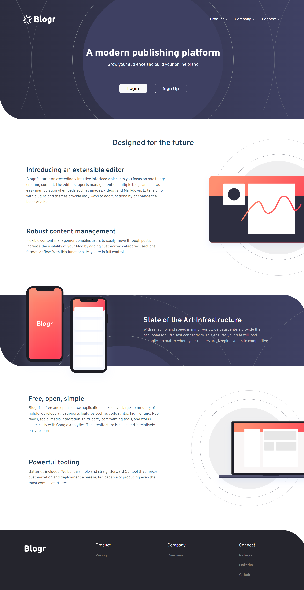
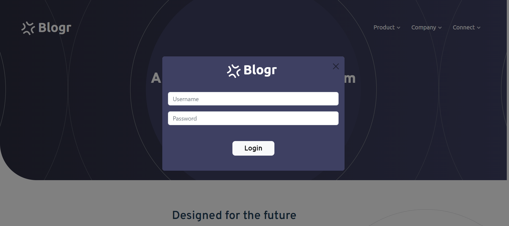
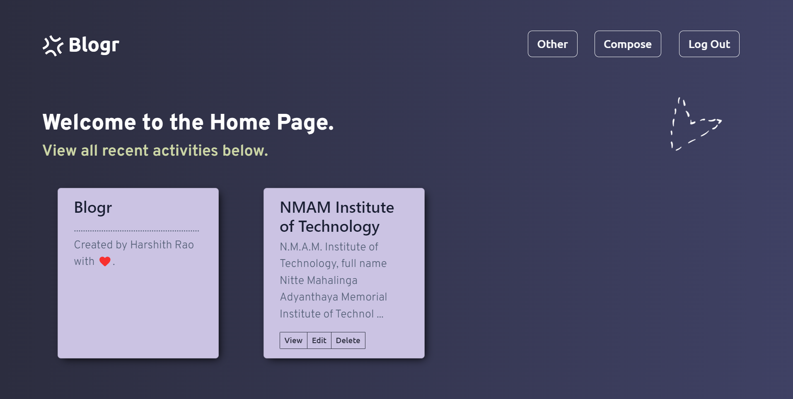
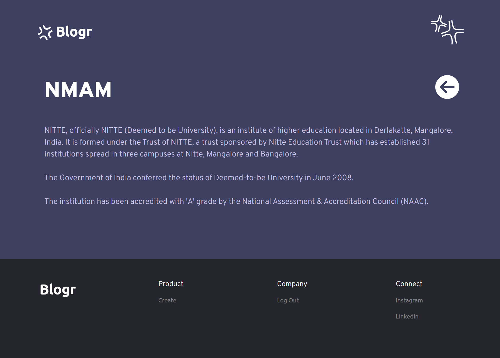
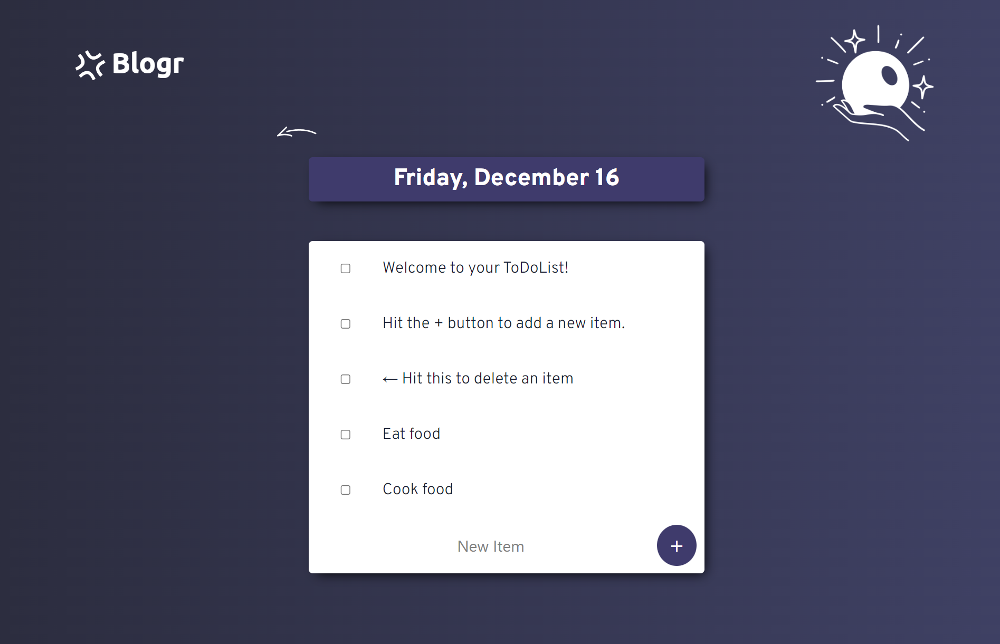
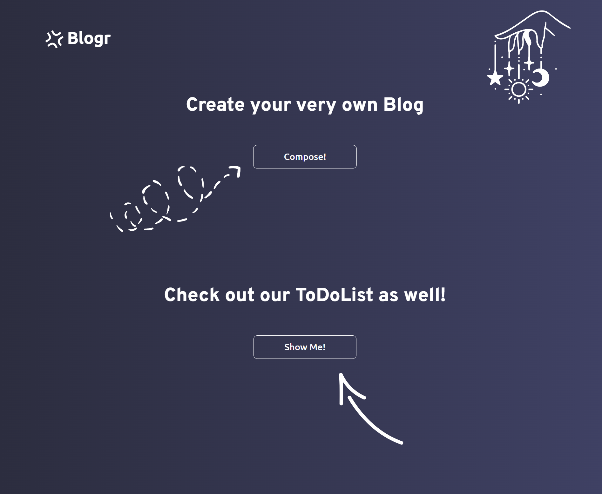

LIVE DEMO :- https://excited-jade-handkerchief.cyclic.app/

The Front-End languages used for building this website are HTML, CSS and JavaScript and the languages used for Back-End are Node.js, Express.js and MongoDB along with the help of EJS templates.

### Getting Started
Node must be installed on your computer
``` 
    npm install 
    node app.js
```

Open http://localhost:3000 with your browser to see the result.

### Screenshots










## Author

- Instagram - (https://www.instagram.com/harshith._.rao/)
- LinkedIn - (https://www.linkedin.com/in/harshithrao07/)
- Github - (https://github.com/harshithrao07)
- Frontend Mentor - (https://www.frontendmentor.io/profile/harshithrao07)
